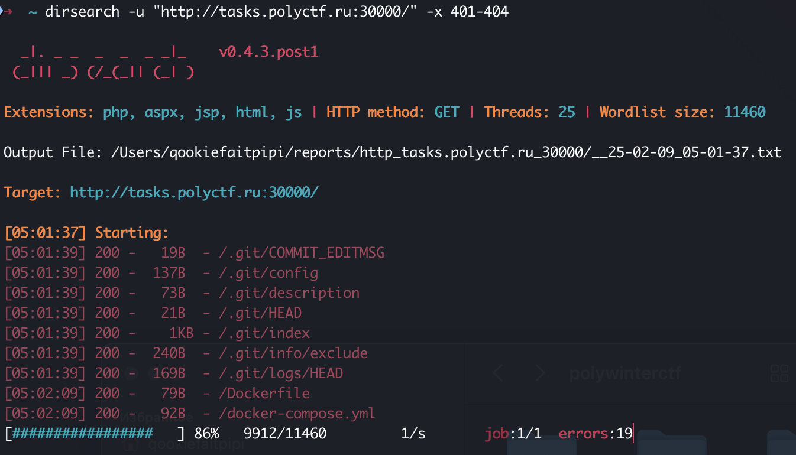
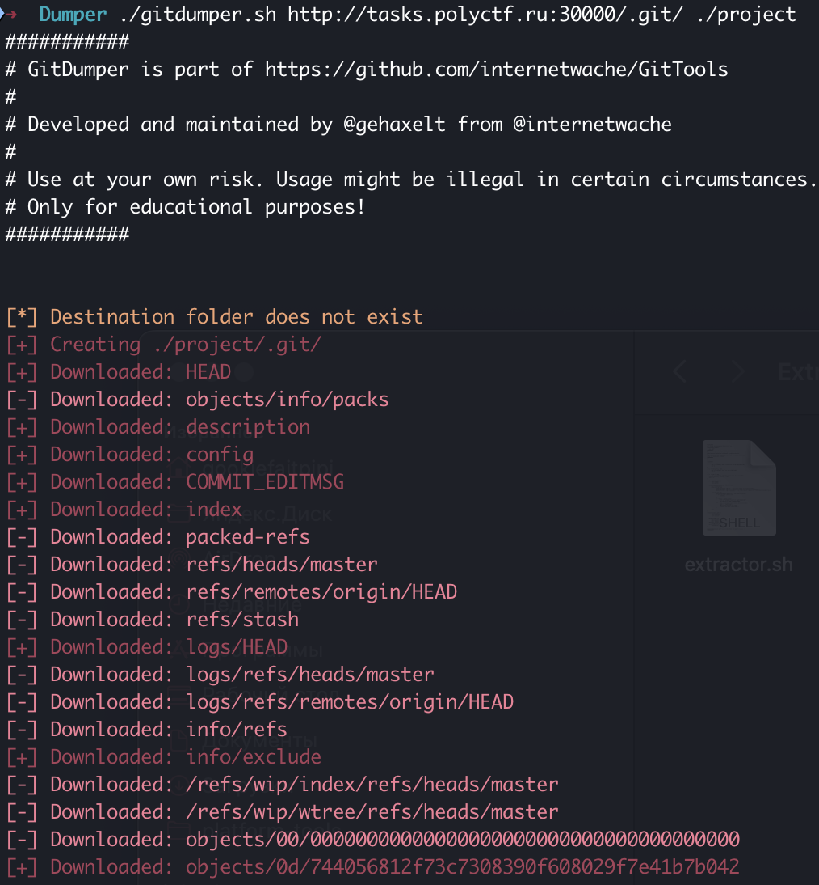
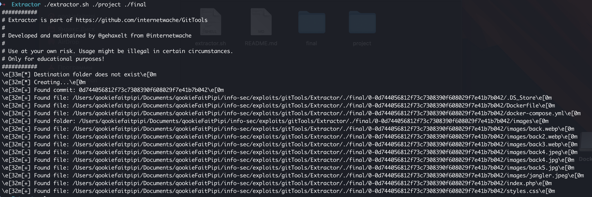
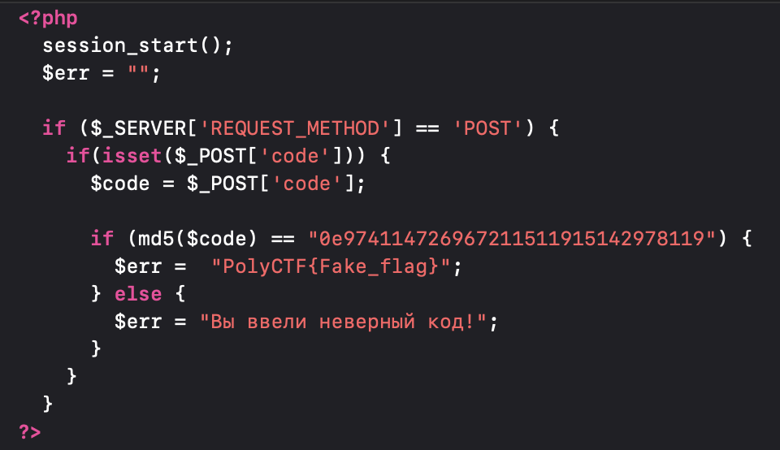

# Начинающий жонглер | easy | web

## Информация
> Вам необходимо научиться самому важному трюку жонглера. Попадите на его представление и узнайте все секреты

## Выдать участинкам
Ссылка [link](http://tasks.polyctf.ru:30000/)

## Описание
В данном задании необходимо восстановить коммит из открытой директории /.git и воспользоваться уязвимостью php type juggling

## Решение
Для решения этого задания можно воспользоваться утилитой dirsearch, для того чтобы увидеть доступность директории /.git:

Далее неободимо выгрузить и восстановить содержимое из папки /.git. Для этого можно использовать утилиту [GitTools](https://github.com/internetwache/GitTools/tree/master)

Для начала выгрузим содержимое с помощью скрипта gitdumper.sh:

`./gitdumper.sh http://tasks.polyctf.ru:30000/.git/ ./project`

Далее восстановить коммиты через утилиту extractor.sh:

`./extractor.sh ./project ./final`

После этой операци был получен исходный коммит. Нужно проанализировать его работу и понять как обрабатывается форма для получения бесплатного билета

В данном коде можно увидеть типовую уязвимость – php type juggling, завязанную на коллизии в md5. Необходимо написать небольшой код для подбора такой строки, хеш которой, начинается на 0e и состоит только из цифр. Также необходимую строку можно найти [тут](https://github.com/swisskyrepo/PayloadsAllTheThings/blob/master/Type%20Juggling/README.md)

## Флаг
`PolyCTF{MD5_AnD_tyPE_jUG9L!n6_IN_PHP_@R3_7r!Cky}`
