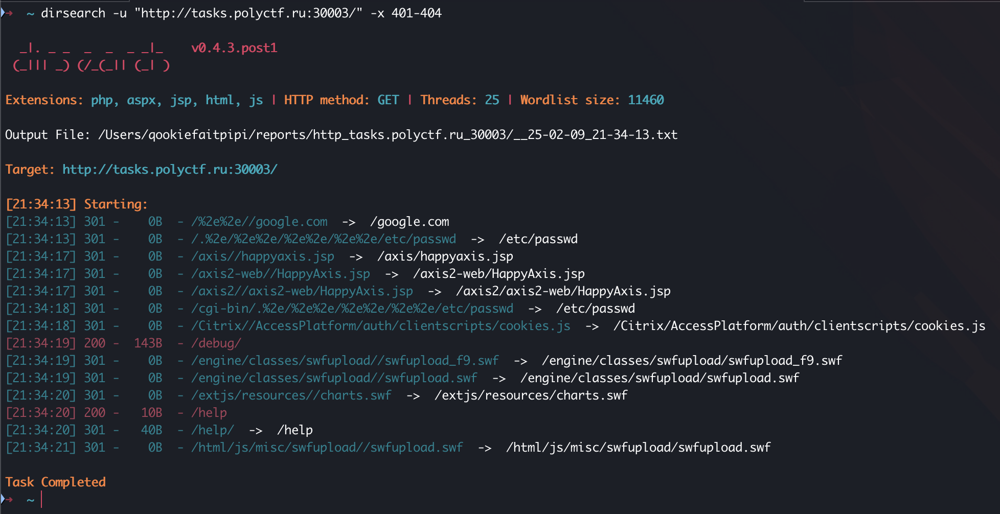
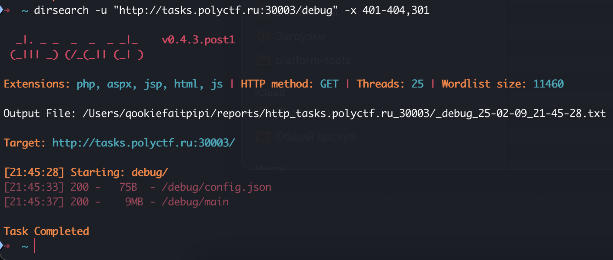

# Go-поревресим | medium | web

## Информация
> Я думал, что Go — это для быстрых решений, но оказалось что go-вно

## Выдать участинкам
Ссылка [link](http://tasks.polyctf.ru:30002)

## Описание
В данном задании необходимо определить, что backend работает в debug-моде и реверснуть .... (САня допиши)))?"""!!!!

## Решение
На этот раз фаззить директории на стороне фронта не имеет смысла. Необходимо фаззить бэк, например, с помощью утилиты [dirsearch](https://github.com/maurosoria/dirsearch)

Из вывода dirseach можно увидеть скрытую директорию /debug, в которой надо снова фаззить. 

Теперь мы можем увидеть, что мы можем скачать main – бинарь, написанный на go. Далее необходимо..... (САня допиши)))?"""!!!!

## Флаг
`PolyCTF{60l4n6_15_r3v3r51bl3}`
